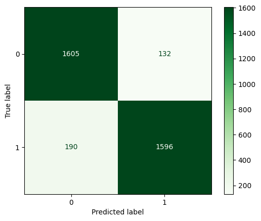
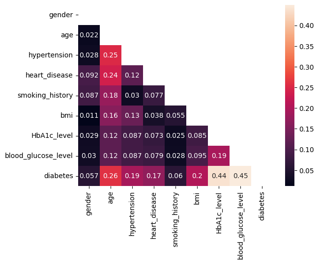

# Previsão de Casos de Diabetes com Machine Learning ⚕️

Este projeto utiliza Machine Learning para prever a presença de diabetes com base em um conjunto de dados médicos. Utilizando técnicas de aprendizado supervisionado, como Gradient Boosting, o objetivo é fornecer uma ferramenta útil para identificar possíveis casos de diabetes.

São utilizados alguns modelos de Inteligência Artificial para poder determinar qual o mais eficienete para o caso.

## Resultados

As avaliações do modelo são realizadas usando **Matriz de Confusão** para visualizar o desempenho do modelo na classificação de casos positivos e negativos.




## Descrição dos Dados

O conjunto de dados contém informações médicas sobre pacientes, incluindo:

- **gender**: Gênero do paciente (0 para feminino, 1 para masculino)
- **age**: Idade do pacient
- **hypertension**: Histórico de hipertensão (0 para não, 1 para sim)
- **heart_disease**: Histórico de doenças cardíacas (0 para não, 1 para sim)
- **smoking_history**: Histórico de tabagismo (0 para nunca, 1 para atual, 2 para ex-fumante)
- **bmi**: Índice de massa corporal
- **HbA1c_level**: Nível de HbA1c (Hemoglobina glicada)
- **blood_glucose_level**: Nível de glicose no sangue
- **diabetes**: Diagnóstico de diabetes (0 para não, 1 para sim)

## Pré-processamento de Dados

O pré-processamento inclui:

- **Tratamento de valores ausentes**: Substituição ou remoção de valores ausentes.
- **Codificação de variáveis categóricas**: Conversão de variáveis categóricas em valores numéricos.
- **Normalização dos dados**: Escalonamento das características para melhorar o desempenho dos modelos.

O gráfico abaixo mostra a correlação entre os dados do dataframe




## Tecnologias Utilizadas

- **Python**: Linguagem de programação utilizada.
- **Pandas**: Manipulação e análise de dados.
- **Scikit-learn**: Modelagem e treinamento de algoritmos de aprendizado de máquina.
- **lightgbm**: Biblioteca que oferece o modelo LGBMClassifier para trainamento utilizando Gradient Boosting
- **Matplotlib**: Visualização de dados.
- **NumPy**: Manipulação eficiente de arrays e operações matemáticas.

## Estrutura do Projeto

- **`data/`**: Diretório contendo o conjunto de dados utilizado para treinamento e testes.
- **`notebooks/`**: Jupyter Notebooks com a análise exploratória dos dados.
- **`src/`**: Scripts e funções principais treinamento de modelos e avaliação.
- **`requirements`**: Arquivo contendo as dependências do projeto.


## Como Usar

1. **Clone o Repositório**

   ```bash
   git clone [https://github.com/seu-usuario/seu-repositorio.git](https://github.com/murilorrs/Diabetes-Prediction-System.git)
   
2. **Instale as dependências**

   ```bash
   pip install -r requirements.txt

***

# Diabetes Case Prediction with Machine Learning ⚕️

This project utilizes Machine Learning to predict the presence of diabetes based on a medical dataset. Using supervised learning techniques such as Gradient Boosting, the goal is to provide a useful tool for identifying potential diabetes cases.

## Results

The model's performance is evaluated using the **Confusion Matrix** to visualize its effectiveness in classifying positive and negative cases.


The results demonstrate a **90%** effectiveness of the model in predicting diabetes, with a detailed analysis of predictions and comparison with actual data.

## Data Description

The dataset contains medical information about patients, including:

- **gender**: Patient's gender (0 for female, 1 for male)
- **age**: Patient's age
- **hypertension**: History of hypertension (0 for no, 1 for yes)
- **heart_disease**: History of heart disease (0 for no, 1 for yes)
- **smoking_history**: Smoking history (0 for never, 1 for current, 2 for former)
- **bmi**: Body Mass Index
- **HbA1c_level**: HbA1c level (Glycated Hemoglobin)
- **blood_glucose_level**: Blood glucose level
- **diabetes**: Diabetes diagnosis (0 for no, 1 for yes)

## Data Preprocessing

The preprocessing includes:

- **Handling missing values**: Replacement or removal of missing values.
- **Categorical variable encoding**: Conversion of categorical variables into numerical values.
- **Data normalization**: Scaling features to improve model performance.

The graph below shows the correlation between the data in the dataframe:


## Technologies Used

- **Python**: Programming language used.
- **Pandas**: Data manipulation and analysis.
- **Scikit-learn**: Modeling and training machine learning algorithms.
- **lightgbm**: Library providing the LGBMClassifier for training using Gradient Boosting.
- **Matplotlib**: Data visualization.
- **NumPy**: Efficient array manipulation and mathematical operations.

## Project Structure

- **`data/`**: Directory containing the dataset used for training and testing.
- **`notebooks/`**: Jupyter Notebooks with exploratory data analysis.
- **`src/`**: Scripts and main functions for model training and evaluation.
- **`requirements.txt`**: File containing project dependencies.

## How to Use

1. **Clone the Repository**

   ```bash
   git clone https://github.com/seu-usuario/seu-repositorio.git

2. **Instal dependencies**

   ```bash
   pip install -r requirements.txt
